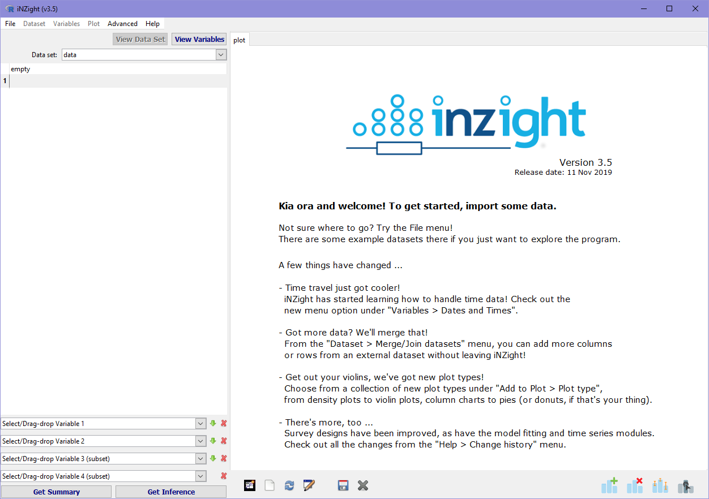

# Part I
```{css,echo=FALSE}
.reveal section img.logo {
    border: none;
    background: transparent;
}

.reveal pre {
    margin-top: 5px;
    margin-bottom: 5px;
}
```

## What is iNZight?


---

```{r,eval=FALSE}
library(iNZight)
iNZight()
```


