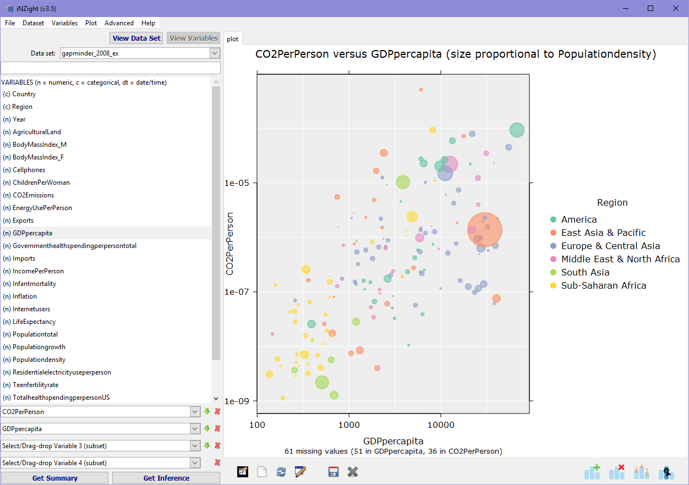

# Part I
```{sass, echo=FALSE}
$col1: #18afe3
$col2: #094b85
.reveal
    pre
        margin-top: 5px
        margin-bottom: 5px

    section
        img.logo
            border: none
            background: transparent
            padding: 0
            margin: 0
            height: 1em

        .social-links
            margin-top: 10vh
            color: $col2
            display: flex
            justify-content: center
            align-items: center

            p
                margin: 0

            .left
                text-align: right
            .right
                text-align: left

            .middle
                margin: 0 40px
                font-size: 1.2em
        strong
            color: $col1

        ul
            list-style-type: none;
            li:before
                font-family: 'FontAwesome'
                content: '\f058'
                margin: 0 5px 0 -40px
                color: $col1

            li.star:before
                content: '\f005'
            li.user:before
                content: '\f007'
            li.users:before
                content: '\f0c0'
            li.code:before
                content: '\f121'
            li.arrow:before
                content: '\f138'
            li.plus:before
                content: '\f055'

```

```{r,echo=FALSE}
ricon <- "<i class=\"fab fa-r-project\"></i>"
ricon <- ""
```

## __What__ is iNZight, and __who__ uses it?


---

```{r,eval=FALSE}
library(iNZight)
iNZight()
```


---

<ul>
<li>`r ricon` package</li>
<li class="fragment">GUI for __visually exploring__ data</li>
<li class="fragment">__easy-to-learn__ tool for students/beginners ...</li>
<li class="fragment">... but also non-beginners!</li>
</ul>

---


---


---

<ul>
<li>`r ricon` package</li>
<li>GUI for __visually exploring__ data</li>
<li>__easy-to-learn__ tool for students/beginners ...</li>
<li>... but also non-beginners!</li>
<li>bridge between __GUI__ and __coding__</li>
</ul>

---

```{sass,echo=FALSE}
.reveal section .dual-panel
    display: flex
    align-items: center

    .left-panel
        flex: 1

    .right-panel
        flex: 1
        position: relative
        height: 600px

        img
            position: absolute
            top: 50%
            left: 0
            width: 500px
            transform: translateY(-50%)

```

<div class="dual-panel">
<div class="left-panel">
Data

<div class="fragment" data-fragment-index="1">
<i class="fa fa-arrow-alt-circle-down"></i>

GUI
</div>

<div class="fragment" data-fragment-index="2">
<i class="fa fa-arrow-alt-circle-down"></i>

Explore
</div>

<div class="fragment" data-fragment-index="3">
<i class="fa fa-arrow-alt-circle-down"></i>

Save `r ricon` script
</div>
</div>

<div class="right-panel">





</div>
</div>


# Part II
## The __development__ of iNZight

---

Another child of the __University of Auckland__


<div class="dual-panel">
<div class="right-panel">
</div>

<div class="left-panel">
<ul>
<li class="user fragment" data-fragment-index="1">Chris Wild </li>
<li class="user fragment" data-fragment-index="2">Statistics __students__
</li>
</ul>
</div>
</div>


---

## How does it __work__?

```{css,echo=FALSE}
.space {
    padding-left: 20px;
    padding-right: 20px;
}
.reveal section .footnotes {
    margin-top: 200px;
    font-size: 0.8em;
}
```

<div style="height:100px"></div>
`r ricon`
<i class="space fas fa-arrows-alt-h"></i> `gWidgets2` + `gWidgets2RGtk2`^&dagger;^
<i class="space fas fa-arrows-alt-h"></i> `RGtk2`^&ddagger;^
<i class="space fas fa-arrows-alt-h"></i> GTK

<div class="footnotes">
&dagger; John Verzani<span style="margin-right: 50px"></span>
&ddagger; Michael Lawrence
</div>

---

<p style="text-align:left">Started off __small__ ...</p>

<ul>
<li class="plus fragment">a __feature__ here ...
<li class="plus fragment">a __module__ there ...
</ul>

<p class="fragment" style="text-align:right">
... et voil&agrave;: a __rewrite__ was needed!
</p>

```{sass,echo=FALSE}
.reveal section ul.list2
    text-align: left
    width: 100%
    margin-top: 50px

```

<ul class="list2">
<li class="fragment">Object Oriented Programming (OOP)</li>
<li class="fragment">Separability</li>
<li class="fragment">Reactivity</li>
<li class="fragment">Extensibility</li>
</ul>


# Object Oriented Programming

<ul>
<li class="fragment code">reference classes</li>
<li class="fragment code">each __component__ of the UI is represented by a __class__</li>
<li class="fragment code">classes have __properties__ ("fields") and __methods__</li>
</ul>

---

```{css,echo=FALSE}
.reveal section code {
    max-height: none;
}
```

```r
LoadDataWindow <- setRefClass("LoadDataWindow",
    fields = list(
        filename = "character"
    ),
    methods = list(
        initialize = function(...) {
            w <- gwindow("Load data")
            g <- ggroup(horizontal = FALSE, container = w)

            # Get filename from user
            fileedit <- gedit(container = g)

            # Load data
            loadbtn <- gbutton("Load", container = g)

            addHandlerKeystroke(fileedit,
                handler = function(h, ...) {
                    filename <<- svalue(h$obj)
                }
            )

            addHandlerClicked(loadbtn, function(h, ...) loadData())
        },
        loadData = function() {
            data <- read.csv(filename)
        }
    )
)
```

---


# Separability

<ul>
<li class="fragment code">keep UI and data logic separate</li>
<li class="fragment code">UI inputs control arguments to a __single function__</li>
<li class="fragment code">existing or new __wrapper__ for another __package__</li>
</ul>

---

```r
LoadDataWindow <- setRefClass("LoadDataWindow",
    fields = list(
        filename = "character"
    ),
    methods = list(
        initialize = function(...) {
            w <- gwindow("Load data")
            g <- ggroup(horizontal = FALSE, container = w)

            # Get filename from user
            fileedit <- gedit(container = g)

            # Load data
            loadbtn <- gbutton("Load", container = g)

            addHandlerKeystroke(fileedit,
                handler = function(h, ...) {
                    filename <<- svalue(h$obj)
                }
            )

            addHandlerClicked(loadbtn, function(h, ...) loadData())
        },
        loadData = function() {
            data <- read.csv(filename)
        }
    )
)
```

---

```r
fields = list(
    filename = "character",
    filetype = "character",
    delimiter = "character", # csv can use , or ;
    ...
)

methods = list(
    initialize(
        ...
    ),
    loadData = function() {
        if (filetype == "csv") {
            data <- read.csv(filename, delimiter = delimiter, ...)
        } else if (filetype == "excel") {
            data <- readxl::read_xls(filename, ...)
        } else ...
    }
)
```

---

```r
fields = list(
    filename = "character",
    filetype = "character",
    delimiter = "character", # csv can use , or ;
    ...
)

methods = list(
    initialize(
        ...
    ),
    loadData = function() {
        # Sanitization
        if (!file.exists(filename)) gmessage("Invalid file")
        ...

        # Call a single function with all arguments
        data <- iNZightTools::smart_read(filename,
            filetype = filetype,
            delim = delimiter,
            ...
        )
    }
)
```

# Reactivity
