# Updates
```{sass, echo=FALSE}
$col1: #18afe3
$col2: #094b85
.reveal
    @import "assets/fontawesome/scss/fontawesome"

    pre
        margin-top: 5px
        margin-bottom: 5px

    .progress span
        background: $col2 !important

    section
        .title
            margin-bottom: 4em;

        img.logo
            border: none
            background: transparent
            padding: 0
            margin: 0
            height: 1em
            &.biglogo
                height: 2em

        .social-links
            margin-top: 10vh
            color: $col2
            display: flex
            justify-content: center
            align-items: center

            p
                margin: 0

            .left
                text-align: right
            .right
                text-align: left

            .middle
                margin: 0 40px
                font-size: 1.2em
        strong
            color: $col1

        ul>li>span
            color: $col1
/***/
```

```{r,echo=FALSE}
ricon <- "<i class=\"fab fa-r-project\"></i>"
ricon <- ""
```


#

```{r,eval=FALSE}
library(iNZight)
iNZight()
```

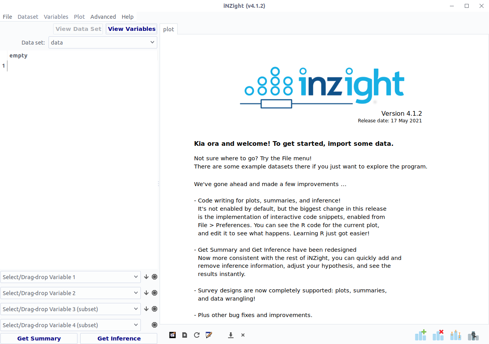

#

<ul class="fa-ul">
<li>
<span class="fa-li"><i class="fas fa-check-circle"></i></span>
`r ricon` package!
</li>
<li class="fragment">
<span class="fa-li"><i class="fas fa-check-circle"></i></span>
GUI for __visually exploring__ data
</li>
<li class="fragment">
<span class="fa-li"><i class="fas fa-check-circle"></i></span>
__easy-to-learn__ tool for students/beginners ...
</li>
<li class="fragment">
<span class="fa-li"><i class="fas fa-check-circle"></i></span>
... but also non-beginners!
</li>
</ul>

#

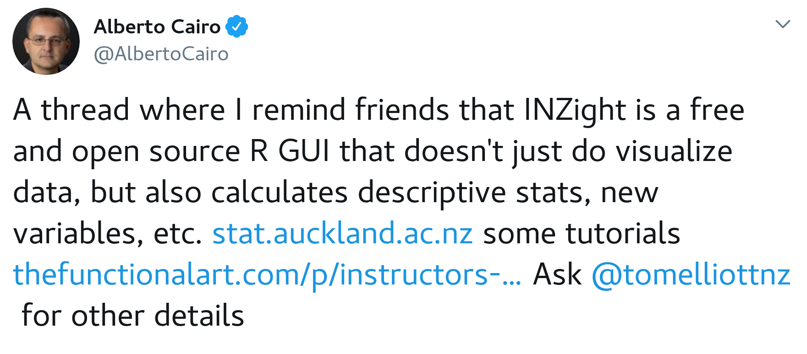
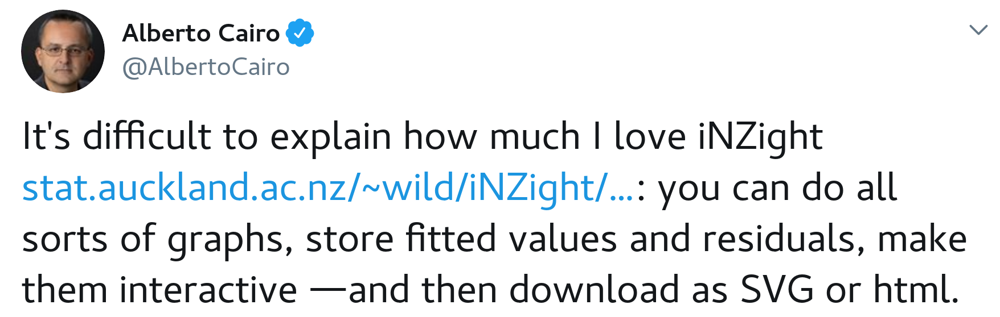


#

<ul class="fa-ul">
<li>
<span class="fa-li"><i class="fas fa-check-circle"></i></span>
`r ricon` package!
</li>
<li>
<span class="fa-li"><i class="fas fa-check-circle"></i></span>
GUI for __visually exploring__ data
</li>
<li>
<span class="fa-li"><i class="fas fa-check-circle"></i></span>
__easy-to-learn__ tool for students/beginners ...
</li>
<li>
<span class="fa-li"><i class="fas fa-check-circle"></i></span>
... but also non-beginners!
</li>
<li>
<span class="fa-li"><i class="fas fa-check-circle"></i></span>
bridge between __GUI__ and __coding__
</li>
</ul>

#

```{sass,echo=FALSE}
.reveal section .dual-panel
    display: flex
    align-items: center
    &.dual-top
        align-items: flex-start

    .left-panel
        flex: 1

    .right-panel
        flex: 1
        position: relative
        height: 600px

        img
            position: absolute
            top: 50%
            left: 0
            width: 500px
            transform: translateY(-50%)
/***/
```

<div class="dual-panel">
<div class="left-panel">
Data

<div class="fragment" data-fragment-index="1">
<i class="fa fa-arrow-alt-circle-down"></i>

GUI
</div>

<div class="fragment" data-fragment-index="2">
<i class="fa fa-arrow-alt-circle-down"></i>

Explore
</div>

<div class="fragment" data-fragment-index="3">
<i class="fa fa-arrow-alt-circle-down"></i>

Save `r ricon` script
</div>
</div>

<div class="right-panel">

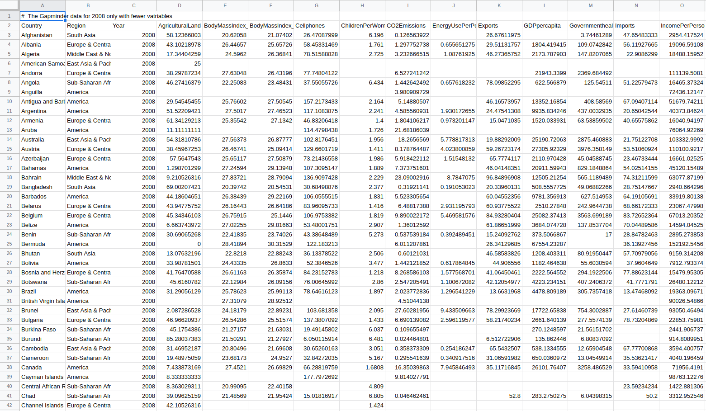

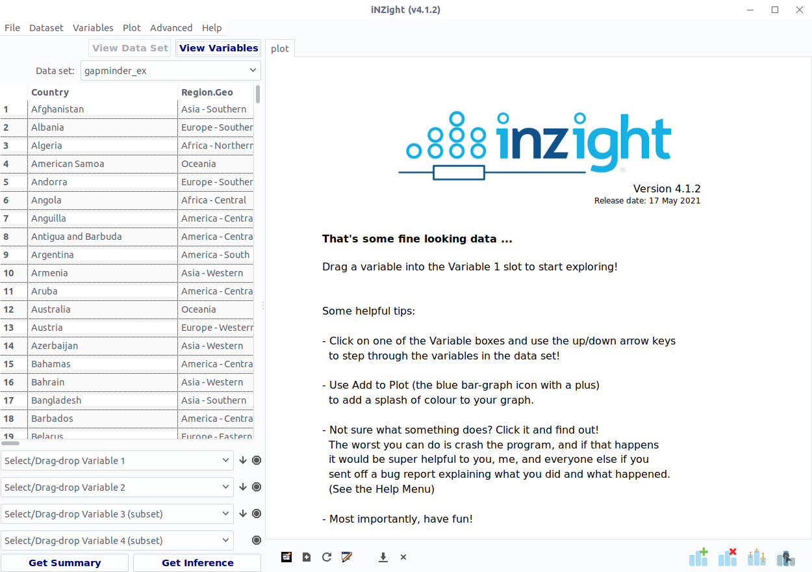

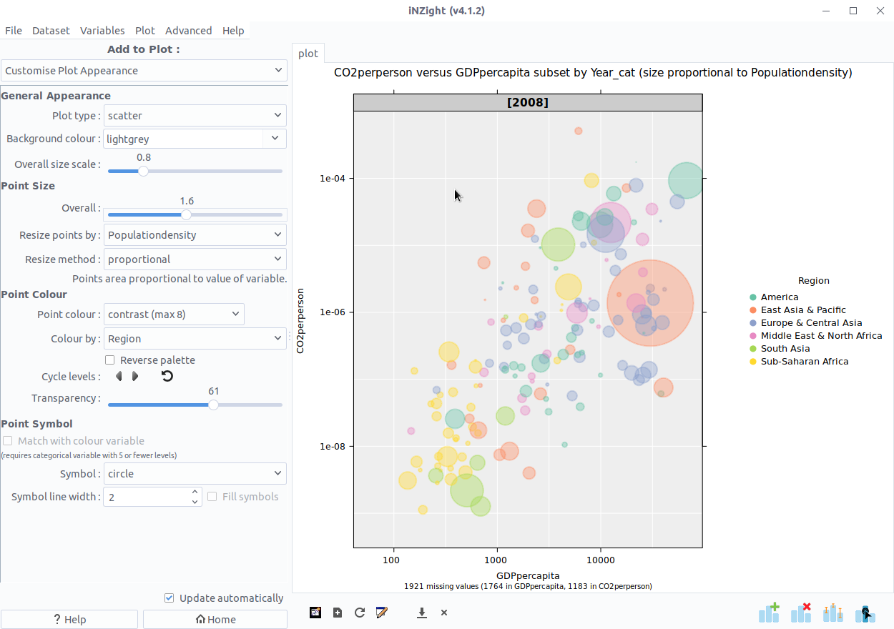

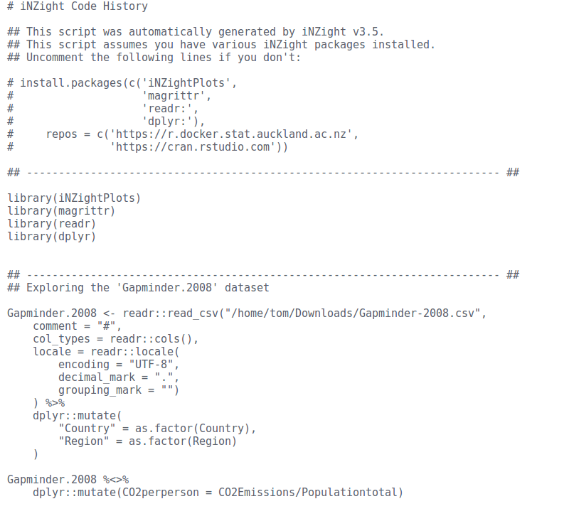

</div>
</div>


# Part II
## The __development__ of iNZight

#


<div class="dual-panel dual-top">
<div class="left-panel">
<i class="fas fa-brain"></i> Chris Wild

</div>

<div class="left-panel fragment">
<i class="fas fa-university"></i> UoA statistics students
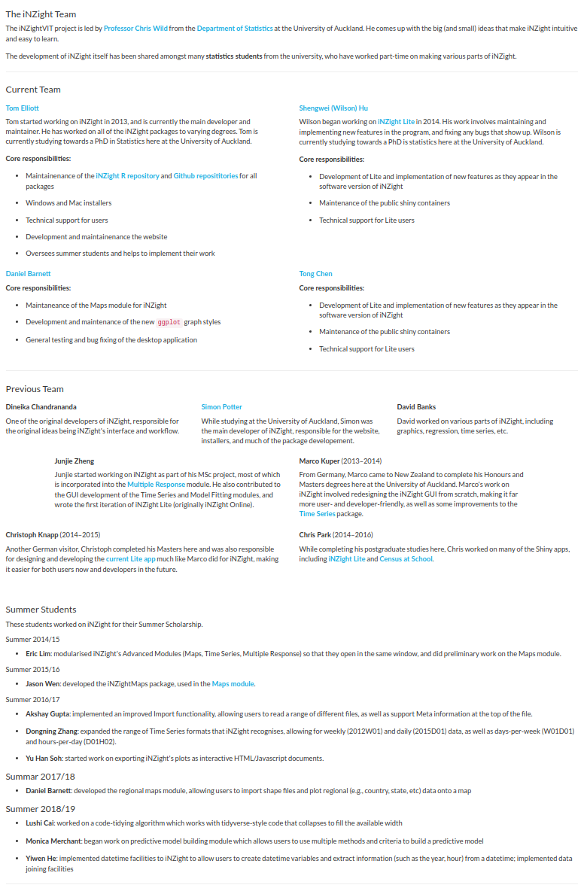
</div>
</div>


#


```{css,echo=FALSE}
.space {
    padding-left: 20px;
    padding-right: 20px;
}
.reveal section .footnotes {
    margin-top: 200px;
    font-size: 0.8em;
}
```

<div style="height:100px"></div>
`r ricon`
<i class="space fas fa-arrows-alt-h"></i> `gWidgets2` + `gWidgets2RGtk2`^&dagger;^
<i class="space fas fa-arrows-alt-h"></i> `RGtk2`^&ddagger;^
<i class="space fas fa-arrows-alt-h"></i> GTK

<div class="footnotes">
&dagger; John Verzani<span style="margin-right: 50px"></span>
&ddagger; Michael Lawrence
</div>

#

<p style="text-align:left">Started off __small__ ...</p>

<ul class="fa-ul">
<li class="fragment">
<span class="fa-li"><i class="fas fa-plus-circle"></i></span>
a __feature__ here ...
</li>
<li class="fragment">
<span class="fa-li"><i class="fas fa-plus-circle"></i></span>
a __module__ there ...
</li>
</ul>

<p class="fragment" style="text-align:right">
... et voil&agrave;: a __rewrite__ was needed!
</p>

```{sass,echo=FALSE}
.reveal section ul.list2
    text-align: left
    width: 100%
    margin-top: 50px
```

#

## What makes Version 2+ __better__?

<ul class="list2 fa-ul">
<li class="fragment">
<span class="fa-li"><i class="fas fa-terminal"></i></span>
Object Oriented Programming (OOP)
</li>
<li class="fragment">
<span class="fa-li"><i class="fas fa-terminal"></i></span>
Separability
</li>
<li class="fragment">
<span class="fa-li"><i class="fas fa-terminal"></i></span>
Reactivity
</li>
<li class="fragment">
<span class="fa-li"><i class="fas fa-terminal"></i></span>
Extensibility
</li>
</ul>


# Object Oriented Programming

<ul class="fa-ul">
<li class="fragment code">
<span class="fa-li"><i class="fas fa-code"></i></span>
each __component__ of the UI is represented by a __class__
</li>
</ul>

#


#

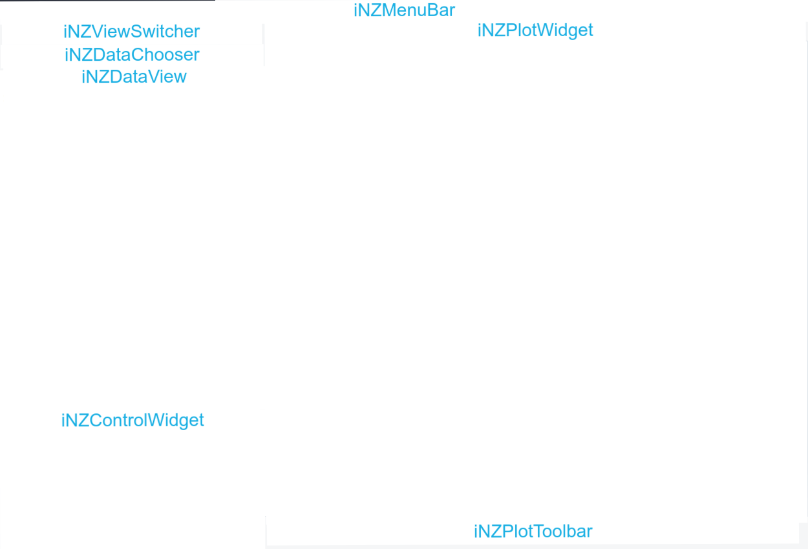

# Object Oriented Programming

<ul class="fa-ul">
<li class=" code">
<span class="fa-li"><i class="fas fa-code"></i></span>
each __component__ of the UI is represented by a __class__
</li>
<li class="fragment code separate">
<span class="fa-li"><i class="fas fa-code"></i></span>
classes have __properties__ ("fields") and __methods__
</li>

<li class="fragment">
<span class="fa-li"><i class="fab fa-r-project"></i></span>
Reference Classes (RC) and R6
</li>
</ul>


#

```{css,echo=FALSE}
.reveal section code {
    max-height: none;
}
```

```r
LoadDataWindow <- setRefClass("LoadDataWindow",
    fields = list(
        filename = "character"
    ),
    methods = list(
        initialize = function(...) {
            w <- gwindow("Load data")
            g <- ggroup(horizontal = FALSE, container = w)

            # Get filename from user
            fileedit <- gedit(container = g)

            # Load data
            loadbtn <- gbutton("Load", container = g)

            addHandlerKeystroke(fileedit,
                handler = function(h, ...) {
                    filename <<- svalue(h$obj)
                }
            )

            addHandlerClicked(loadbtn, function(h, ...) loadData())
        },
        loadData = function() {
            data <- read.csv(filename)
        }
    )
)
```

```{sass,echo=FALSE}
.reveal section .loadwindow
    position: fixed
    top: 50%
    left: 50%
    transform: translate(-50%, -50%)
    border: none
    background: none
```


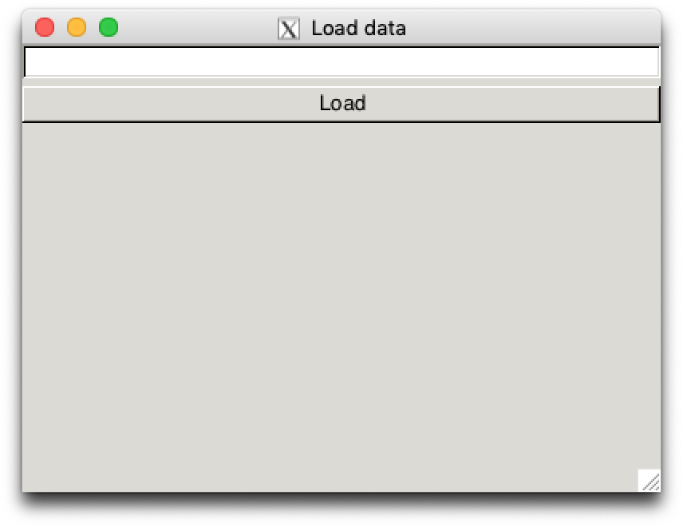


# Separability

<ul class="fa-ul">
<li class="fragment">
<span class="fa-li"><i class="fas fa-code"></i></span>
keep UI and data logic separate
</li>
<li class="fragment">
<span class="fa-li"><i class="fas fa-code"></i></span>
Desktop and Shiny versions use the same data logic
</li>
<li class="fragment">
<span class="fa-li"><i class="fas fa-code"></i></span>
UI inputs control arguments to a __single function__
</li>
<li class="fragment">
<span class="fa-li"><i class="fas fa-code"></i></span>
existing or new __wrapper__ for another __package__
</li>
</ul>

#

```r
LoadDataWindow <- setRefClass("LoadDataWindow",
    fields = list(
        filename = "character"
    ),
    methods = list(
        initialize = function() { ... },
        loadData = function() {
            data <- read.csv(filename)
        }
    )
)
```

#

```r
LoadDataWindow <- setRefClass("LoadDataWindow",
    fields = list(
        filename = "character",
        filetype = "character",
        delimiter = "character", # csv can use , or ;
        ...
    ),
    methods = list(
        initialize = function(...),
        loadData = function() {
            if (filetype == "csv") {
                data <- read.csv(filename, delimiter = delimiter, ...)
            } else if (filetype == "excel") {
                data <- readxl::read_xls(filename, ...)
            } else ...
        }
    )
)
```

#

```r
LoadDataWindow <- setRefClass("LoadDataWindow",
    fields = list(
        filename = "character",
        filetype = "character",
        delimiter = "character", # csv can use , or ;
        ...
    ),
    methods = list(
        initialize = function(...),
        loadData = function() {
            data <- iNZightTools::smart_read(filename,
                filetype = filetype,
                delim = delimiter,
                ...
            )
        }
    )
)
```

#

```r
LoadDataWindow <- setRefClass("LoadDataWindow",
    fields = list(
        filename = "character",
        filetype = "character",
        delimiter = "character", # csv can use , or ;
        ...
    ),
    methods = list(
        initialize(...),
        loadData = function() {
            data <- iNZightTools::smart_read(filename,
                filetype = filetype,
                delim = delimiter,
                ...
            )
            cat(iNZightTools::code(data), file = "script.R")
        }
    )
)
```

```{r,eval=FALSE}
# script.R
data <- readr::read_csv("data.csv", delim = ";", comment = "#")
```

#

```r
LoadDataWindow <- setRefClass("LoadDataWindow",
    fields = list(
        filename = "character",
        filetype = "character",
        delimiter = "character", # csv can use , or ;
        ...
    ),
    methods = list(
        initialize(...),
        loadData = function() {
            data <- iNZightTools::smart_read(filename,
                filetype = filetype,
                delim = delimiter,
                ...
            )
            cat(iNZightTools::code(data), file = "script.R")
        }
    )
)
```

```{r,eval=FALSE}
# script.R
data <- readxl::read_excel("data.xlsx")
```

# Reactivity

<ul class="fa-ul">
<li class="fragment">
<span class="fa-li"><i class="fas fa-code"></i></span>
<strong>Instant</strong> feedback
</li>
<li class="fragment">
<span class="fa-li"><i class="fas fa-code"></i></span>
Makes <strong>exploring</strong> data <strong>faster and easier</strong>
</li>
<li class="fragment">
<span class="fa-li"><i class="fas fa-code"></i></span>
Widget <strong>handlers</strong><br>
_Change, keystroke, click, mouseover, focus, ..._
</li>
</ul>

#

```{r,eval=FALSE}
Demo <- setRefClass("Demo",
    field = list(
        data = "data.frame",
        colour = "character"
    ),
    methods = list(
        initialize = function() {
            w <- gwindow("Demo")
            g <- ggroup(horizontal = FALSE, container = w)
            col <- gcombobox(
                c("Orangered", "Goldenrod", "Steelblue"),
                container = g,
                handler = function(h, ...) {
                    colour <<- svalue(h$obj)
                    draw()
                }
            )

            data <<- data.frame(x = rnorm(100), y = rnorm(100))
            colour <<- "Orangered"

            draw()
        },
        draw = function() {
            plot(y ~ x,
                data = data,
                col = colour
            )
        }
    )
)
```

# Extensibility

```{sass,echo=FALSE}
.reveal section ul>li.separate
    margin-bottom: 1em
```

<ul class="fa-ul">
<li class="fragment">
<span class="fa-li"><i class="fas fa-code"></i></span>
<strong>Foresight</strong> and <strong>planning</strong>
</li>
<li class="fragment">
<span class="fa-li"><i class="fas fa-code"></i></span>
Add <strong>new</strong> or change <strong>existing</strong> features ...
</li>
<li class="fragment separate">
<span class="fa-li"><i class=""></i></span>
... without rewriting everything!
</li>
<li class="fragment">
<span class="fa-li"><i class="fas fa-code"></i></span>
<strong>OOP:</strong> add new classes, inheritance, ...
</li>
<li class="fragment separate">
<span class="fa-li"><i class="fas fa-code"></i></span>
<strong>Separability:</strong> new field = new argument<br>everything else unchanged
</li>

<li class="fragment">
<span class="fa-li"><i class="fas fa-code"></i></span>
In progress: a system for adding __completely new__ modules
</li>
</ul>

#

```r
# DemoModule.R
DemoModule <- setRefClass(
    "Demo Module",
    contains = "CustomModule",
    fields = list(
        GUI = "ANY",
        ...
    ),
    methods = list(
        initialize = function(gui, name) {
            callSuper(gui,
                name = name,
                embedded = TRUE
            )
            ...
        },
        ...
    )
)
```

#

<div style="text-align:left;">
`path/to/iNZightVIT/modules`

<ul class="fa-ul">
<li>
<span class="fa-li"><i class="fas fa-plus-circle"></i></span>
`DemoModule.R`
</li>
</ul>
</div>

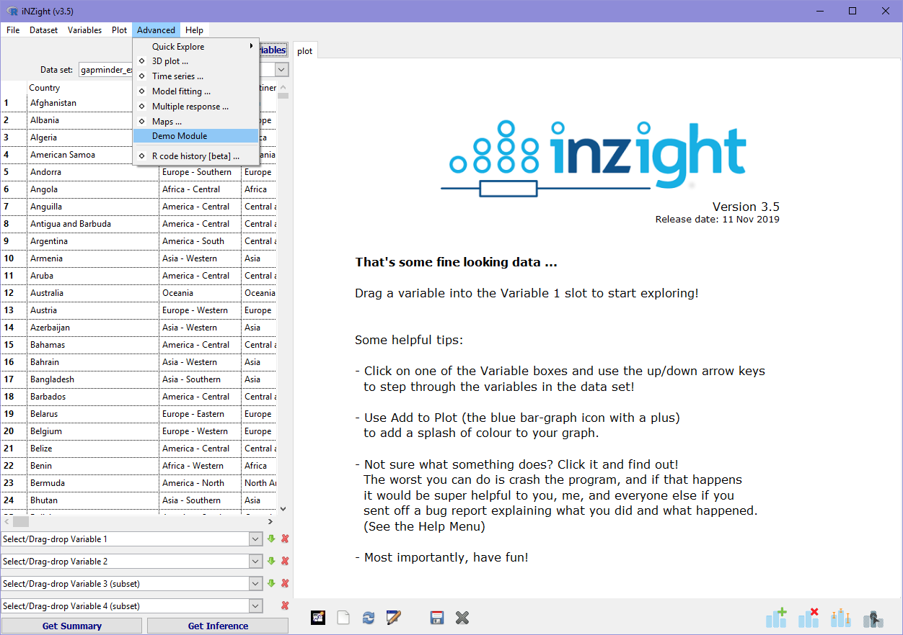

#


<div style="text-align:left;">
`path/to/iNZightVIT/modules`

<ul class="fa-ul">
<li>
<span class="fa-li"><i class="fas fa-plus-circle"></i></span>
`DemoModule.R`
</li>
</ul>
</div>

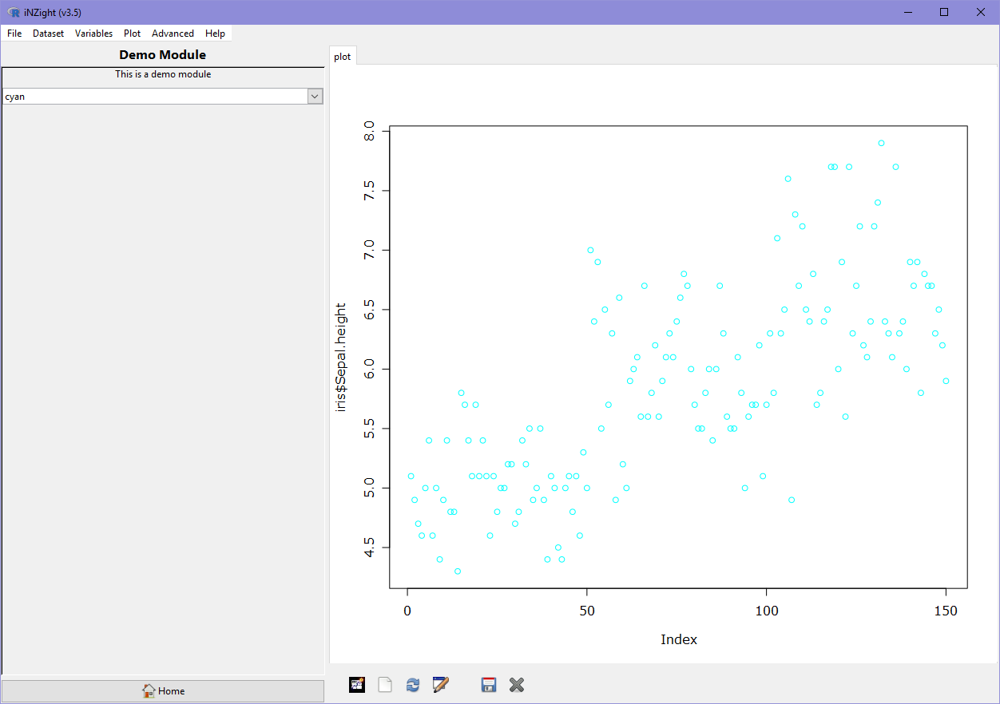


# Thank you


<div class='social-links'>
<div class='left'>
<p><strong>tmelliott</strong></p>
<p><strong>@tomelliottnz</strong></p>
</div>
<div class='middle'>
<p><i class='fab fa-github'></i></p>
<p><i class='fab fa-twitter'></i></p>
</div>
<div class='right'>
<p><strong>iNZightVIT</strong></p>
<p><strong>@iNZightUoA</strong></p>
</div>
</div>

<div style="margin-bottom:3em"></div>
### Slides: __bit.ly/iNZightSatRday__
