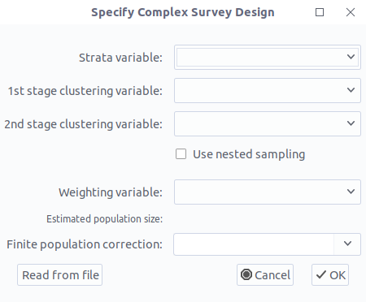
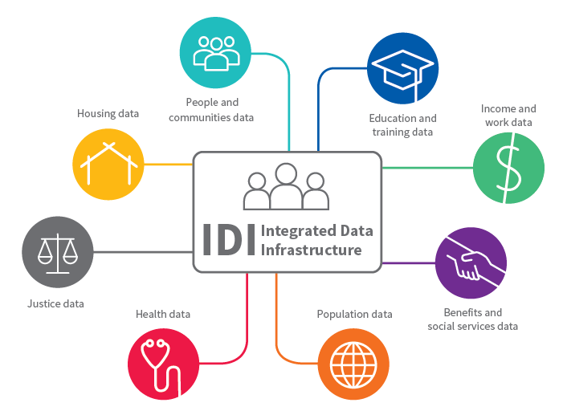
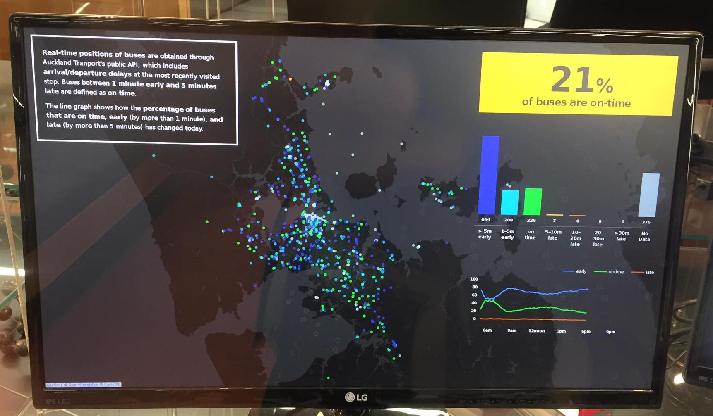

<!--# Updates-->

```{r,echo=FALSE}
ricon <- "<i class=\"fab fa-r-project\"></i>"
ricon <- ""
```
<!--
#

## PhD thesis

* submitted 9th April
* defended 25th August
* graduation tomorrow!

#

## PhD thesis (TL;DR)

<ul class="loose">
<li>predicting buses is hard.</li>

<li><strong>real-time traffic data from other buses</strong> to predict upcoming ones ... </li>
<ul class="fa-ul">
    <li class="fragment">
        <span class="fa-li"><i class="far fa-thumbs-down"></i></span>
        point estimates
    </li>
    <li class="fragment">
        <span class="fa-li"><i class="far fa-thumbs-up"></i></span>
        interval estimates
    </li>
</ul>

<li class="fragment">$\mathbb{P}$(catch bus | I arrive by), $\mathbb{P}$(bus arrives before 9am)</li>
<li class="fragment">useful for <strong>probabilistic journey planning</strong></li>
</ul>

<p class="fragment">If you're interested ... [tomelliott.co.nz/phd](https://tomelliott.co.nz/phd)</p>
-->

## Postdoc @ VUW @ UoA

* MBIE Endeavour grant

    * Colin Simpson (VUW), Barry Milne (COMPASS), Andrew Sporle

    * Informatics for Social Services and Wellbeing ...

    * more later!

* Honorary position here (thanks James)

# 


***

```{r,eval=FALSE}
library(iNZight)
iNZight()
```


# 


* lead developer since 2013/14

* shifting focus as audience has evolved

# 

### Before 2015

<ul class="fa-ul loose">
<li><span class="fa-li"><i class="fas fa-school"></i></span> schools</li>
<li><span class="fa-li"><i class="fas fa-university"></i></span> some university</li>
</ul>

# 
### 2015--2019

<ul class="fa-ul loose">
<li><span class="fa-li"><i class="fas fa-graduation-cap"></i></span> education (school/university/MOOC)</li>
<li><span class="fa-li"><i class="fas fa-globe"></i></span> unexpected places
<ul class="fa-ul loose">
    <li class="fragment"><span class="fa-li"><i class="fas fa-newspaper"></i></span> data journalism</li>
    <li class="fragment"><span class="fa-li"><i class="fas fa-paw"></i></span> wildlife manager in Canada</li>
</ul>
</li>
</ul>

# 

### Recently

<ul class="fa-ul">
<li><span class="fa-li"><i class="fas fa-users"></i></span> <strong>democratisation</strong>
<p>See Chris Wild's talks featuring hits like <i class="fas fa-music"></i> <em>We Will Plot You</em></p>
</li>
<li><span class="fa-li"><i class="fas fa-tachometer-alt"></i></span> <strong>rapid research development</strong>
<p>for organisations/groups with low/no money/time/both</p>
</li>
</ul>


# Surveys and iNZight

# 

* recent focus on surveys --- now handled natively!

    * plots
    * summaries (tables of counts)
    * inference / modelling
    * data wrangling ...

* key goal is **removal of barriers**

***

<div class="dual-panel">
<div class="left-panel">
Data

<div class="fragment" data-fragment-index="1">
<i class="fa fa-arrow-alt-circle-down"></i>

GUI
</div>

<div class="fragment" data-fragment-index="2">
<i class="fa fa-arrow-alt-circle-down"></i>

Explore
</div>

<div class="fragment" data-fragment-index="3">
<i class="fa fa-arrow-alt-circle-down"></i>

Export results/code
</div>
</div>

<div class="right-panel">


</div>
</div>

***

## What if `data` is from a survey?


***

In `r ricon`

```r
my_survey <- survey::svydesign(...args...)
```

***

iNZight isn't much better ... <span class="fragment"><strong>or is it?!</strong></span>



(Remember survey variables *never* have nice names)


***

## Academic Performance Index (API) data
##### (two-stage cluster sample)

<ul class="fa-ul loose">
<li><span class="fa-li"><i class="fas fa-file-csv"></i></span> apiclus2.csv</li>
<li><span class="fa-li"><i class="fas fa-file-alt"></i></span> apiclus2.svydesign</li>
</ul>

***

## Demo: apiclus2.svydesign

```
data = "apiclus2.csv"
ids = "dnum + snum"
fpc = "fpc1 + fpc2"
```

Details: [inzight.nz/docs/survey-specification.html](https://inzight.nz/docs/survey-specification.html)

<ul class="fa-ul loose">
<li><span class="fa-li"><i class="fas fa-wheelchair"></i></span> accessible</li>
<li><span class="fa-li"><i class="fas fa-tachometer-alt"></i></span> quickly open and explore</li>
<li><span class="fa-li"><i class="fas fa-desktop"></i></span> business as usual
<ul>
    <li>plots</li>
    <li>summaries/inference (population counts)</li>
    <li>data wrangling</li>
</ul>
</li>
</ul>


# (A few) Details
## iNZight's `r ricon` package collection

***
## 9+ **iNZight*** packages

* **iNZight** (GUI interface, collects user input, displays results)

* **iNZightModules** (UI for time series, regression, maps, ...)

* **iNZightPlots** (graphs, summaries, inference)

* **iNZightTools** (utility functions, data wrangling)

* **iNZightTS** (time series)

* **iNZightMR** (multiple response)

* **iNZightRegression** (model summaries, residual plots)

* **iNZightMaps** (lat/lng points, fill-in-the-shapefile maps)

* plus **vit** and some others ...

***

* **wrapper functions** makes programming GUIs easier

    * inputs $\equiv$ arguments

* packages don't need GUI

    * `iNZightPlots::inzplot()`

    * simple functions aimed towards novice coders

* returns the R code


<p class="fragment">GUI $\rightarrow$ high level functions $\rightarrow$ lower-level (e.g., <strong>ggplot</strong>)</p>


***
## An example: Filtering data


```{r}
library(iNZightTools)
iris_filtered <- filterNumeric(iris, "Sepal.Width", "<", 3.5)
head(iris_filtered)
code(iris_filtered)
```


***
## A slightly more complex example


```{r}
iris_agg <- aggregateData(iris, "Species", c("median", "var"), "Sepal.Length")
head(iris_agg)
code(iris_agg)
```


***

## What about surveys?

***

* modified wrapper functions to handle surveys

* refactored GUI to pass around a 'data-thing' (data or survey)

```{r,message=F,warning=F}
library(survey)
data(api, package = "survey")
dclus2 <- svydesign(id = ~dnum+snum,
    fpc = ~fpc1+fpc2,
    data = apiclus2
)
dclus2_filtered <- filterNumeric(dclus2, "api99", ">=", 700)
code(dclus2_filtered)
```

**Big thanks to the 'srvyr' package!**


# Te Rourou Tātaritanga {#terourou}


<p>


</p>

<p class="fragment current-visible" data-fragment-index="1"><em>Nā tō rourou, nā taku rourou, ka ora ai te iwi.</em></p>


***

## Primary goals

<ol type="1">
<li><p>Improve data standards</p></li>
<li class="fragment highlight-blue" data-fragment-index="1"><p>Promote Māori data sovereignty</p></li>
<li class="fragment highlight-blue" data-fragment-index="1"><p>Develop systems to support access</p></li>
<li><p>Evaluate synthesising of datasets</p></li>
<li><p>Security and privacy implications</p></li>
<li><p>Machine learning and AI methods</p></li>
</ol>

[terourou.org](https://terourou.org)


***
## The Integrated Data Infrastructure (IDI)



* database connecting data across NZs sectors

* high security environment

* but also other unnecessary barriers: **coding**!

***
## iNZight to the rescue!

* high school and/or university

* no coding necessary

* easy to learn **and relearn**

* iNZight in Stats NZ data lab ...? Watch this space!


***
## iNZight in the Data Lab (WIP)

Start confined to (example) small data sets ...

* primary researcher: SQL $\Rightarrow$ CSV

* non-coding researchers: graphs, tables, ...

... and build from there!

***
## iNZight outside the Data Lab

* groups/organisations/communities

    * population summaries (tables of counts)

    * regression models

    * demographic information ...?

* easy to learn **and relearn**

    * repeat analyses after 6 months / 2 years

    * no (or low) (re)training or consultation costs

* produces R code script

***
## Bayesian small area demography

*Some important demographic information for communites (e.g., birth or death rates) requires specialist techniques and models.*

<ul class="fragment">
<li><p>John Bryant’s R packages (<strong>dembase</strong>, <strong>demest</strong>, …) for Bayesian demography</p></li>
<li><p>R coding required (and data transformations, working with multi-dimensional arrays, …)</p></li>
<li class="fragment"><p>so we tested out iNZight’s new add-on system …</p></li>
</ul>

***
## DEMO


# Other projects

Both work and 'fun'


***

## IDI Search app

* simple web app (ReactJS)

* searchable database

* researchers can explore what's available

[terourou.org/idisearch](https://terourou.org/idisearch)


***
## DEMO

[idi-search.web.app](https://idi-search.web.app/)

***
## Bus display v2



<ul>
<li>
<p>the display in 302 was broken</p>
</li>

<li class="fragment"><p>rebuilt it (again) using ReactJS + d3</p></li>
<li class="fragment"><p>uses newly available real-time occupancy</p></li>
</ul>

***
## DEMO

[tomelliott.co.nz/bus-display](https://tomelliott.co.nz/bus-display/)

***
## Lots of ReactJS ...

<ul class="fragment loose">
<li>long-term goal: a prototype of iNZight built with ReactJS and R-serve</li>

<li>a single app for Windows / macOS / Linux / web</li>

<li>connecting to local/remote R server (user permissions, firewall, etc.)</li>
</ul>


# Thank you


<div class="social">

<i class="fab fa-github"></i>
<span>tmelliott</span>
<span>iNZightVIT</span>
<span>terourou</span>

<i class="fab fa-twitter"></i>
<span>@tomelliottnz</span>
<span>@iNZightUoA</span>
<span>@terourou</span>

<i class="fas fa-link"></i>
<span>tomelliott.co.nz</span>
<span>inzight.nz</span>
<span>terourou.org</span>

</div>

<div class="footer">


</div>
